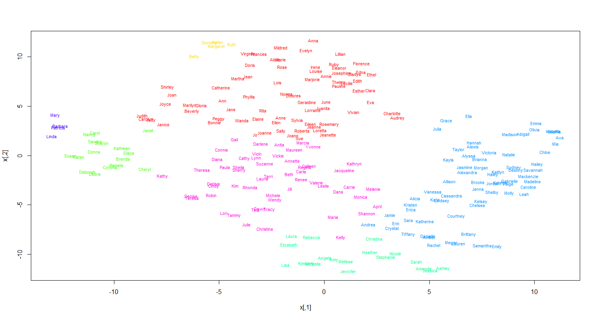

```{r setup, include=FALSE}
knitr::opts_chunk$set(echo = FALSE)
```
<br>
The [babynames package](https://github.com/hadley/babynames) put together by Hadley Wickham is a lot of fun for teaching R. This package contains a dataset of the same name that contains the number of boys and girls born each year since 1880 with every name.

What you’ll notice if you play around with graphing the distribution of children born with particular names is that there are different patterns. Some names were popular long ago, some are only popular recently, others have had ups and downs in popularity. For a bit of fun, I thought it would be interesting to try and identify different patterns through principal components analysis (PCA) and clustering techniques.


Let's load the libraries we'll need and the data:

<br>
```{r, warning=FALSE, message=FALSE, echo=TRUE}
### load packages
library(babynames) 
library(gridExtra)
library(tidyverse)
library(colorspace)
library(tsne)


head(babynames)
tail(babynames)
```
<br>

As can be seen, this dataset records the number of children (n) of each name (name) that are boys or girls (sex) that were born in each year (year). The data go from 1880-2017. Additionally, the proportion (prop) of children born with that name in each year.

To plot the pattern of an individual name over time, I'm going to write a little custom function:

<br>
```{r, warning=FALSE, message=FALSE, echo=TRUE}
# Function to plot a name over time
plot_name <- function(bname = NULL) {
  babynames %>%
  filter(name==bname) %>% 
  ggplot(aes(year, n)) +
  geom_line(aes(color=sex), lwd=1) +
  scale_color_manual(values = c("firebrick1", "dodgerblue")) +
  theme_bw() +
  ggtitle(bname)
}
```
<br>


<br>
```{r, warning=FALSE, message=FALSE, echo=TRUE}
grid.arrange(
  plot_name("Barbara"),
  plot_name("Megan"),
  plot_name("Jennifer"),
  plot_name("Irene"),
  ncol=2
)
```
<br>


We'll just focus on female names. These are the most popular female names of all time:

<br>
```{r, warning=FALSE, message=FALSE, echo=TRUE}
babynames %>%
  filter(sex == "F") %>%
  group_by(name) %>%
  summarize(total = sum(n)) %>%
  arrange(-total)
```
<br>

We can also see that there are 67,046 unique female names in the dataset. Here are some of the least common names:


<br>
```{r, warning=FALSE, message=FALSE, echo=TRUE}
babynames %>%
  filter(sex == "F") %>%
  group_by(name) %>%
  summarize(total = sum(n)) %>%
  arrange(total)
```
<br>

In fact there are 9,595 names that appear 5 times only in the dataset.  To be entered into the data, each name must have been registered at least five times in a given year. So for all of these names, in one year there were five children born with that given name - and that was the only year.

<br>
```{r, warning=FALSE, message=FALSE, echo=TRUE}
babynames %>%
  filter(sex == "F") %>%
  group_by(name) %>%
  summarize(total = sum(n)) %>%
  filter(total==5) %>%
  nrow()
```
<br>

For instance, the first name on the list - Aada - was given to five children in 2015:

<br>
```{r, warning=FALSE, message=FALSE, echo=TRUE}

babynames %>% filter(name == "Aada")

```
<br>

**Reshape Data**

The first exploration of these data that I’d like to do is to perform a PCA on the distribution of the frquency of names over years. This will give us a general idea of how many different ‘components/groups’ we might expect.

To do this, we need to have our data in a ‘wide’ format, with each column/variable representing a year and each row representing the total number of births that year for that particular name. We'll put the names into rownames so we can keep that information, but only have numbers in the dataframe.

<br>
```{r, warning=FALSE, message=FALSE, echo=TRUE}
babywideF <- 
  babynames %>% 
  filter(sex=="F") %>% 
  select(name, year, n) %>%
  pivot_wider(names_from = year, values_from = n, values_fill = list(n = 0))

rownames(babywideF)<- babywideF %>% .$name  #set rownames
babywideF <- babywideF %>% select(-name) # remove name variable
```
<br>

Here are the first 5 rows and 4 columns of the dataframe, as well as the rownames:

<br>
```{r, warning=FALSE, message=FALSE, echo=TRUE}
babywideF[1:5,1:4]
rownames(babywideF)[1:5]
```
<br>


**PCA**

For this sort of exploratory analysis, I’m going to simply use the default PCA function in R - `princomp()` and plot scree plots.


<br>
```{r, warning=FALSE, message=FALSE, echo=TRUE}
### principal components analysis - females
resF.pca <- princomp(babywideF)
plot(resF.pca)
```
<br>

The above scree plot seems to indicate that there is one major component of names that accounts for the majority of variance. There then appears to be a few more components that account for a fair amount of variance. Depending on how micro-detailed we want to go, we could look for 4 or 5 components fairly reasonably. Though there may be something of interest in looking at 7 or 8 groups.

<br>


**Clustering**

To explore which names show more similar distribution patterns to one another over time, I’m going to firstly use k-means hierarchical clustering. There are pros and cons to all clustering methods. A problem with k-means is that you can get different clusters each time you run it due to how the method operates. An upside is that it is a fairly flexible method…

The clustering is done with the `kmeans()` function and by setting the number of clusters to find. After saving the results, we can look at how many individual names have been put into each cluster (the relative number of the cluster isn’t that important - e.g. if we re-run the clustering, the clusters with most names could be called by a different cluster number in future runs). I am going to `set.seed()` to make sure that this code is repeatable.


<br>
```{r, warning=FALSE, message=FALSE, echo=TRUE}
###k-means clustering analysis
set.seed(100)
resF.k <- kmeans(babywideF, 6)
table(resF.k$cluster)
```
<br>

The majority of names (66,808) are contained within the 1st component. The other five components have a much more manageable number of names.

Let’s look at some of these names in more detail. We'll start with the smallest cluster - remember, these are names that should show very similar trends over time in the frequency of births:

<br>
```{r, warning=FALSE, message=FALSE, echo=TRUE}
names(resF.k$cluster[resF.k$cluster==1])
```
<br>

This first group seems to make sense. You could well imagine someone called Mildred who had friends from her childhood called Dorothy and Betty.

The next smallest cluster has these names, which appear to be boomer-era names:

<br>
```{r, warning=FALSE, message=FALSE, echo=TRUE}
names(resF.k$cluster[resF.k$cluster==4])
```
<br>

Then we have this cluster, which look to be more children of the 1980s:

<br>
```{r, warning=FALSE, message=FALSE, echo=TRUE}
names(resF.k$cluster[resF.k$cluster==2])
```
<br>

The next biggest cluster are names that are more recent still:

<br>
```{r, warning=FALSE, message=FALSE, echo=TRUE}
names(resF.k$cluster[resF.k$cluster==3])
```
<br>

Finally, we have a large cluster of 119 names.  The relationship of these names to each other might take some more digging:

<br>
```{r, warning=FALSE, message=FALSE, echo=TRUE}

names(resF.k$cluster[resF.k$cluster==5])
```
<br>

Just for completeness, here is a random sample of 10 names from 'cluster 6'. As can be seen, these tend to be uncommon names.

<br>
```{r, warning=FALSE, message=FALSE, echo=TRUE}
set.seed(17)
sample(names(resF.k$cluster[resF.k$cluster==6]),10)
```
<br>

**Repeat the Process?**

It might be more beneficial to repeat this process, but exclude the less common names. To do this we will filter our data by not keeping any names that appear in cluster 6. This leaves us with 238 names.

<br>
```{r, warning=FALSE, message=FALSE, echo=TRUE}
group1x <- names(resF.k$cluster[resF.k$cluster<6])
length(group1x)
```
<br>

We can only keep these names, and redo our PCA:

<br>
```{r, warning=FALSE, message=FALSE, echo=TRUE}
babywideF1 <- babywideF %>%  filter(rownames(.) %in% group1x) 

### principal components analysis - females
resF1.pca <- princomp(babywideF1)
plot(resF1.pca)

```
<br>

The scree plot again indicates approximately three or four main components, plus perhaps 3 or 4 'fringe' ones. Let’s redo our K-means clustering with 7 clusters, just because it might be more fun/interesting to try and split names up as much as possible to see if it makes logical sense.

<br>
```{r, warning=FALSE, message=FALSE, echo=TRUE}
###k-means clustering analysis
set.seed(10)
resF1.k <- kmeans(babywideF1, 7)
table(resF1.k$cluster)
```
<br>

Again, let’s look at these in a bit more detail, this time looking from smallest group to largest. The first four appear to be older names. When we can compare their distributions on a plot, we can see that they are very similar having large peaks in the 1950s - although Mary also has a large peak in the 1920s:


<br>
```{r, warning=FALSE, message=FALSE, echo=TRUE}
babynames %>%
  filter(sex=="F") %>%
  filter(name %in% group1x[resF1.k$cluster==6]) %>% 
  ggplot(aes(year, n)) +
  geom_line(aes(color=name, group=name), lwd=1) +
  theme_classic() +
  scale_color_discrete_qualitative(palette = "Dark 2")
```
<br>

The next cluster of five names are even older names, all peaking in the 1920s: 


<br>
```{r, warning=FALSE, message=FALSE, echo=TRUE}
babynames %>%
  filter(sex=="F") %>%
  filter(name %in% group1x[resF1.k$cluster==2]) %>% 
  ggplot(aes(year, n)) +
  geom_line(aes(color=name, group=name), lwd=1) +
  theme_classic() +
  scale_color_discrete_qualitative(palette = "Dark 2")
```
<br>

If I'm being picky, I would suggest that the peak of Betty is just after the other four names, and Margaret has a second peak in the 1950s. It's possible we could find other names that match these patterns, but grouping these five together obviously has some merits.


The next group is cluster 3, which has 16 names - all very popular names during the 1950s & 1960s:

<br>
```{r, warning=FALSE, message=FALSE, echo=TRUE}
babynames %>%
  filter(sex=="F") %>%
  filter(name %in% group1x[resF1.k$cluster==3]) %>% 
  ggplot(aes(year, n)) +
  geom_line(aes(color=name, group=name), lwd=1, alpha = .8) +
  theme_classic() +
  scale_color_discrete_qualitative(palette = "Harmonic")
```
<br>

The next group is cluster 4, which has 18 names:

<br>
```{r, warning=FALSE, message=FALSE, echo=TRUE}
babynames %>%
  filter(sex=="F") %>%
  filter(name %in% group1x[resF1.k$cluster==4]) %>% 
  ggplot(aes(year, n)) +
  geom_line(aes(color=name, group=name), lwd=1, alpha=.8) +
  theme_classic() 
```
<br>

This group looks to be generally names that were popular during the 1970s and 1980s. However, there are a couple of names in here which look a bit out of place. The green line that has a large peak in the 1920s is Elizabeth. The blue line with a peak just after the 1960s is Lisa. The green line with the largest peak in the early 1970s is Jennifer. This name does have a similar pattern to the others - it's just that it is so popular it has an elevated peak.

Here are Elizabeth and Lisa separated from the rest - Elizabeth is trimodal in its distribution having multiple periods of poularity!

<br>
```{r, warning=FALSE, message=FALSE, echo=TRUE}
grid.arrange(
  plot_name("Elizabeth"),
  plot_name("Lisa"),
  ncol=2
)
```
<br>

The last three clusters - clusters 1, 5 and 7 have between 55-73 names each. Here, I'll just plot each without showing the names.  

Cluster 5 appears to include names from the 1990s, some having mini-peaks in the 1920s:

<br>
```{r, warning=FALSE, message=FALSE, echo=TRUE}
babynames %>%
  filter(sex=="F") %>%
  filter(name %in% group1x[resF1.k$cluster==5]) %>% 
  ggplot(aes(year, n)) +
  geom_line(aes(group=name), color="#123abc", lwd=1, alpha=.2) +
  theme_classic() +
  theme(legend.position = 'none')
```
<br>

Three of the names that appear to have had the peaks in the 1920s as well as post 1990s are Ella, Grace and Julia:

```{r, warning=FALSE, message=FALSE, echo=TRUE}

babynames %>%
  filter(sex=="F") %>%
  filter(name=="Grace" | name=="Julia" | name=="Ella") %>% 
  ggplot(aes(year, n)) +
  geom_line(aes(color=name), lwd=1) +
  theme_classic()
```

<br>

Cluster 7 appears to include names from the 1960s, being popular a litle after the boomers of cluster 3.


<br>
```{r, warning=FALSE, message=FALSE, echo=TRUE, preview=TRUE}
babynames %>%
  filter(sex=="F") %>%
  filter(name %in% group1x[resF1.k$cluster==7]) %>% 
  ggplot(aes(year, n)) +
  geom_line(aes(group=name), color="lightseagreen", lwd=1, alpha=.2) +
  theme_classic() +
  theme(legend.position = 'none')
```
<br>

Cluster 1 is a little more mixed. There are clearly some 1920s names in here, but also possibly some other pre WW2 popular names.

<br>
```{r, warning=FALSE, message=FALSE, echo=TRUE}
babynames %>%
  filter(sex=="F") %>%
  filter(name %in% group1x[resF1.k$cluster==1]) %>% 
  ggplot(aes(year, n)) +
  geom_line(aes(group=name), color="orange", lwd=1, alpha=.2) +
  theme_classic() +
  theme(legend.position = 'none')
```
<br>


**TSNE mapping**

An intriguing way of mapping multidimensional data into a 2d plot is to use [T-distributed Stochastic Neighbor Embedding](https://cran.r-project.org/web/packages/tsne/tsne.pdf). This can be done in the R package `tsne`.

Below I create a distance object, `D`, on which we will run the tsne analysis. I also create a dataframe to store the names, cluster id, and cluster color.


<br>
```{r, warning=FALSE, message=FALSE, echo=TRUE, eval=F}

D <- dist(babywideF1)  #create distance object


cluster1 <- group1x[resF1.k$cluster==1]
cluster2 <- group1x[resF1.k$cluster==2]
cluster3 <- group1x[resF1.k$cluster==3]
cluster4 <- group1x[resF1.k$cluster==4]
cluster5 <- group1x[resF1.k$cluster==5]
cluster6 <- group1x[resF1.k$cluster==6]
cluster7 <- group1x[resF1.k$cluster==7]


# creating dataframe for plotting colors and text on final plot
namesdf <- data.frame(
              name = c(cluster1, cluster2, cluster3, cluster4, 
                       cluster5, cluster6, cluster7), 
              group = c(rep(1, length(cluster1)), 
                        rep(2, length(cluster2)), 
                        rep(3, length(cluster3)), 
                        rep(4, length(cluster4)), 
                        rep(5, length(cluster5)), 
                        rep(6, length(cluster6)), 
                        rep(7, length(cluster7)))
           )
                    

namesdf <- namesdf[match(group1x, namesdf$name),] #names in correct order to match rownames of babywideF1 

colors = rainbow(7)
names(colors) = unique(namesdf$group)

#define function used in plotting
ecb = function(x,y){ plot(x,t='n'); text(x,labels=namesdf$name, col=colors[namesdf$group], cex=0.5) }

#plot
tsne_D = tsne(D, k=2,  epoch_callback = ecb, perplexity=50)

```
<br>

```{r, out.width = "400px"}

```

<br>

This is pretty cool. This data reduction and visualization method actually maps pretty well to what we did before. The different groups are denoted by different colors. Some logical patterns emerge. 

The 1950s names - Barbara, Linda, Mary and Patricia are together in purple on the left hand side.  Close by in lime green are the boomer names that were popular a little later. At the top in yellow are the names that were really popular in the 1920s (e.g. Dorothy, Helen).

The names that have become very popular recently (e.g. Isabella, Madison, Abigail) are on the far right side of visual space in light blue. Interestingly, Grace and Julia position next to each other with Ella not too far away - these are the names that were popular early and then have had a recent resurgence.

The names in green at the bottom are those such as Jennifer that were very popular in the late 70s and 80s. Significantly, Lisa and Kimberly are close to each other - this might be because their peaks were pre 1975. Julie is another with pre-1975 peaks, but that name is in a different cluster. The names in blue close to the green group are the names that blossomed in the 80s and 90s before more recently declining in popularity such as Megan and Lauren.

Finally, much could be done to look for further patterns in the red and pink groups, but that will have to wait for another time !  There is also much that can be done with the less common names - again, we'll look at those another time.
