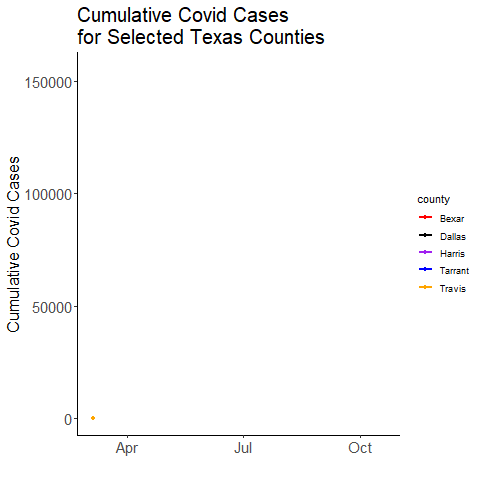

```{r setup, include=FALSE}
knitr::opts_chunk$set(echo = FALSE)
```

In this post I shall show how to scrape Texas covid data and create animated plots. The purpose is to demonstrate how this can all be done seamlessly with R, without the need to download or manually edit the excel files in any way.

Texas covid data is stored at [this website](https://dshs.texas.gov/coronavirus/additionaldata.aspx). For this post we will focus on the link "Cases over Time by County".  This link leads to an excel sheet with covid cases by county.  Unfortunately, like many excel files, it is filled with random text that isn't data - e.g. titles, notes etc.  We will need to edit the file before working with the data.


### Importing the Data

To directly import an excel file that lives at a web link we need the `RCurl` package. We download the file into a temporary location (our working directory), and then we read that with `read_xlsx()` from the `readxl` package. Because I'm using a Windows machine, I need to include `,  mode = "wb"` at the end of the `download.file()` function.  If you're on a different operating system, you could delete this bit.


<br>
```{r, message=FALSE, warning=FALSE, echo=TRUE}
library(RCurl)
library(readxl)

# for Windows, mode = 'wb'
download.file("https://dshs.texas.gov/coronavirus/TexasCOVID19DailyCountyCaseCountData.xlsx", "temp.xlsx", mode = "wb")
tmp <- read_xlsx("temp.xlsx")

```
<br>

### Cleaning the Data

We have our excel file imported as a dataframe in R called `tmp`.  Let's look at its size, and then we'll look at the first 5 rows and 4 columns:

<br>
```{r, message=FALSE, warning=FALSE, echo=TRUE}
dim(tmp)

tmp[1:5, 1:4]

```
<br>

As you can see, the top of the dataframe is messy.  The colnames are nonsensical. The first row is also not related to anything we need.  The second row appears to have something of value.  It appears that the third row is when our county names and data begin.

Let's look at the second row in more detail. We can look at the first three entries:

<br>
```{r, message=FALSE, warning=FALSE, echo=TRUE}
as.character(tmp[2,1:3])
```
<br>

The first entry is what should be the column name of column 1 - the county name. The other entries have a lot of random text (a remnant of some excel formatting) and some numbers at the end.  Indeed, the last five characters refer to the date. If we grab the last five characters of each entry in this row, we will have our dates.  When doing this, I also noticed that two dates (July 15th and July 17th) had asterisks at the end also.  This is because down at the bottom of the excel book there were footnotes relating to these dates - some extra data were included on these dates.

We can grab all the dates by getting the last 5 characters (using `str_sub()` from `stringr`) and ignoring asterisks (using `gsub()` - and we have to do `\\*` to make sure that it really knows we mean asterisks. We'll make these our new column names:


<br>
```{r, message=FALSE, warning=FALSE, echo=TRUE}
colnames(tmp) <- stringr::str_sub(gsub("\\*", "", tmp[2,]),-5)


```
<br>

We can now get rid of the nonsense top two rows, and take a look at our data:

<br>
```{r, message=FALSE, warning=FALSE, echo=TRUE}

tmp <- tmp[-c(1:2),]

tmp[1:5, 1:4]


```
<br>

These excel worksheets often have garbage at the bottom of the data - let's check this:

<br>
```{r, message=FALSE, warning=FALSE, echo=TRUE}

tmp[250:nrow(tmp), 1:3]

```
<br>

It looks like after the county Zavala, we have several rows of stuff we don't need. These are totals, sub-totals and footnotes.  As we want to make this code reproducible - and the authors of the excel sheet may add more footnotes in the future - we'll tell R to locate 'Zavala' and cut-off the datasheet there. We'll also call the dataframe `df` as it's now clean:

<br>
```{r, message=FALSE, warning=FALSE, echo=TRUE}
df <- tmp[1:which(tmp[,1]=="Zavala"),]
df[1:5,1:4]

```
<br>

The final thing we'd like to do to help with plotting and summary stats, is to conver this dataset from wide to long.

We'll also make the first column name say 'county' and make sure the format of the date, and the value (number of Covid cases) are correct:


<br>
```{r, message=FALSE, warning=FALSE, echo=TRUE}

library(tidyverse)

df.long <- df %>% pivot_longer(2:ncol(df), names_to = "date")

colnames(df.long)[1]<-"county"

df.long$date <- as.Date(df.long$date, format = "%m-%d")

df.long$value <- as.numeric(df.long$value)

head(df.long)

```
<br>

### Visualizing

For a first plot, we'll use `tidyverse` to count up all the covid cases on each day for all counties of Texas.  Then we'll plot those data as a line graph. We're using `scales` here to make sure the y-axis has readable numbers:

<br>
```{r, message=FALSE, warning=FALSE, echo=TRUE}
library(scales)

df.long %>%
  group_by(date) %>%
  summarise(total = sum(value)) %>%
  ggplot(aes(x=date, y = total)) + 
  geom_line(color="#123abc", lwd=1) +
  theme_classic() +
  scale_y_continuous(labels = comma_format()) +
  ylab("Total Cases") +
  xlab("") +
  ggtitle("Number of Covid Cases in Texas 2020") +
  theme(axis.title = element_text(size=16))

```
<br>

Now we are going to set ourselves the task of animating the Covid cases over time.  We don't want to do it for all 254 counties, so we will pick the five counties that have the most cases.  We'll use `tidyverse` to group by `county` to find the total cases per county:

<br>
```{r, message=FALSE, warning=FALSE, echo=TRUE}

# let's pick the five highest counties.

df.long %>%
  group_by(county) %>%
  summarise(total = sum(value)) %>%
  arrange(-total)

```
<br>

We can now grab the five counties with the most cases, and then filter our long dataframe to only include those counties using `%in%`:

<br>
```{r, message=FALSE, warning=FALSE, echo=TRUE}
# we can automatically grab these like this:

df.long %>%
  group_by(county) %>%
  summarise(total = sum(value)) %>%
  arrange(-total) %>%
  .$county %>%
  head(5) -> my_counties

my_counties

#only keep data with these

df.long %>%
  filter(county %in% my_counties) -> df.x

head(df.x)
```
<br>

Now to animate.  We will use the `gganimate` package.  This should work "out-of-the-box", however, you may need to also install the `av` or `gifski` packages to ensure that it doesn't just make hundreds of still images, but instead compiles them into an animation.  The only bit of code we need to add to an otherwise static plot is the line `+ transition_reveal(date)` which means we are animating along our x-axis (`date`). We use `anim_save()` to save the animation

<br>
```{r, message=FALSE, warning=FALSE, echo=TRUE, eval=FALSE}
# May take a few seconds
ggplot(df.x, aes(x=date, y=value, color=county)) +
  geom_line(lwd=1) +
  geom_point() +
  scale_color_manual(values=c("red", "black", "purple", "blue","orange"))+
  ggtitle("Cumulative Covid Cases \n for Selected Texas Counties") +
  theme_classic() +
  ylab("Cumulative Covid Cases") +
  xlab("")+
  theme(
    axis.title = element_text(size=16),
    plot.title = element_text(size=20)
    )+
  transition_reveal(date) 

# Save at gif:
anim_save("covid.gif")

```
<br>

{width=150%; height=150%}

<br>